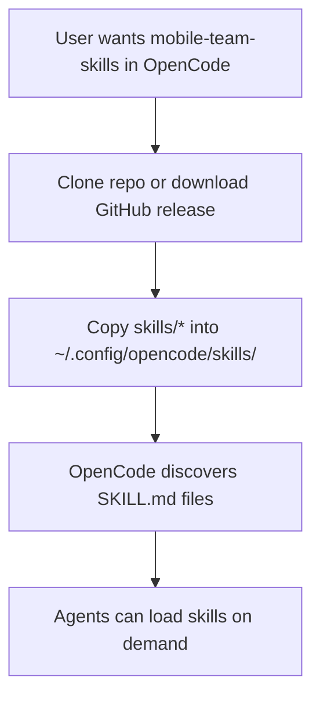

# OpenCode Install Docs Design

**Goal:** Clarify how this repository should be used from OpenCode without introducing duplicate skill trees or a separate OpenCode packaging system.

## Decision

Use a docs-only approach in `README.md`.

## Rationale

- OpenCode discovers skills from filesystem paths such as `~/.config/opencode/skills/`, `~/.agents/skills/`, and `~/.claude/skills/`.
- This repository is already distributed through GitHub releases and Claude plugin metadata, but it is not an OpenCode JavaScript/npm plugin package.
- Duplicating the skill tree into `.opencode/skills` would increase maintenance cost without improving the source of truth.

## Scope

- Keep the existing Claude Code `/plugin` install instructions.
- Add an OpenCode-specific install section to `README.md`.
- Explain that OpenCode installation is file-copy based, not plugin-marketplace based for this repo.
- Mention compatible install destinations and the recommended OpenCode-native path.

## Non-Goals

- No `.opencode/plugins` package implementation.
- No npm package publication.
- No ecosystem submission workflow changes.

## User Flow

## Acceptance Criteria

- README clearly separates Claude Code install from OpenCode install.
- README states that GitHub releases are the distribution point.
- README does not imply that this repo is an OpenCode npm/plugin package.
